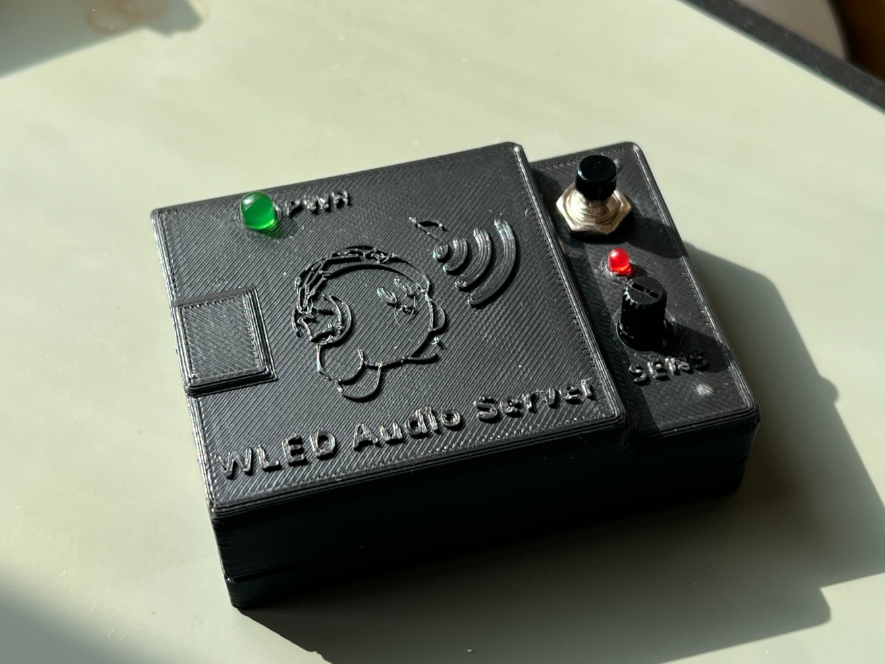
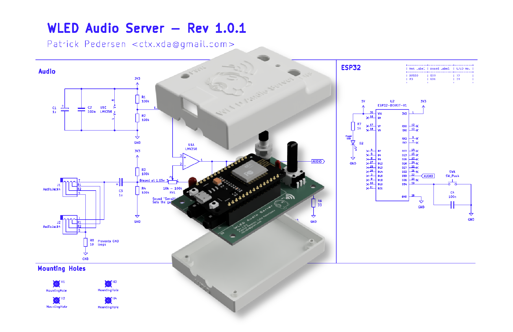

# WLED Audio Server

This compact device is designed to function as a WLED audio server. It analyzes 3.5mm audio input and synchronizes audio-reactive effects across multiple WLED devices using the "Sync" feature. I.e. this is just a "headless" WLED controller.

## Hardware

This device features two 3.5mm audio jacks: one for input and one for through-output (orientation is interchangable). This allows the server to be placed in-line between an audio source and a speaker system.

A potentiometer is used to adjust the gain of the audio input. This lets you amplify quieter signals or reduce the gain for louder ones to clipping. To help with this, a small red clipping LED is included.

Additionally, a push-button is provided, which can be assigned to a specific WLED action, such as changing the effect.

Finally, a power LED is included to indicate when the device is powered on.

## Firmware

For enhanced audio-reactive capabilities, it is highly recommended to use the **[MoonModules fork of WLED](https://mm.kno.wled.ge/)** on both the audio server and all connected WLED devices. This fork includes additional features and optimizations specifically designed for audio-reactive setups.

A [pre-configured firmware binary](WLED-MM_esp32_4MB_M_14.5.1-dev_preconfigured.bin) for the audio server is available in this repository for quick setup.
